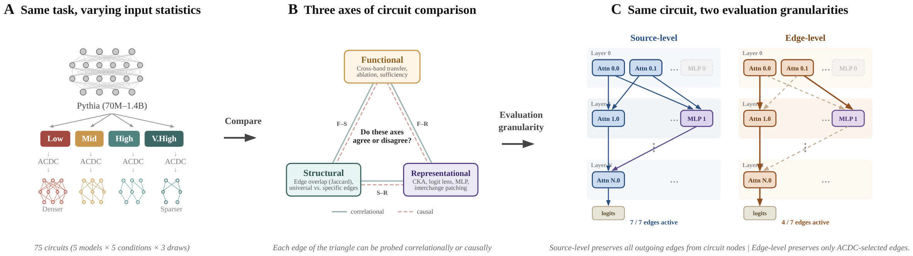

# Many Circuits, One Mechanism: Input Variation and Evaluation Granularity in Circuit Discovery

[](#citation)
[](LICENSE)
[](#setup)

Code and experiment artifacts accompanying the paper
**"Many Circuits, One Mechanism: Input Variation and Evaluation Granularity in Circuit Discovery"**
by Alireza Bayat Makou, Jingcheng Niu, Subhabrata Dutta, and Iryna Gurevych
(UKP Lab, Technical University of Darmstadt), 2026.



> **Disclaimer.** This repository contains experimental software and is published for the sole purpose of giving additional background details on the respective publication.

## Abstract

Circuit discovery methods identify subgraphs that explain specific model behaviors, and structural differences between discovered circuits are commonly interpreted as evidence of distinct mechanisms. We test this assumption by varying input statistics while holding the task fixed, and show that the resulting structural differences exhibit apparent specialization but do not correspond to functional differences, a pattern we term *phantom specialization*. Using Literal Sequence Copying across four token-frequency bands in five Pythia models (70M to 1.4B), we extract 75 circuits and find that structurally distinct circuits implement the same computation: band-specific edges transfer broadly across bands, a shared core recovers at least 99% of circuit performance, and causal interchange interventions confirm that internal representations are interchangeable across frequency bands. Repeated extractions within the same frequency band further suggest that discovery algorithms sample from an equivalence class of valid subgraphs rather than recovering a unique mechanism. Standard evaluation practice obscures this pattern: source-level evaluation inflates apparent faithfulness, while edge-level evaluation reveals the many-to-one mapping from structure to function. Our results show that structural differences between circuits are not sufficient evidence for distinct mechanisms, and that exposing this requires edge-level evaluation and cross-condition transfer tests.

## Overview

This repository contains data preparation, circuit discovery, evaluation, and multi-phase analysis code for the Literal Sequence Copying (LSC) study across the Pythia model family.

## Repository structure

```text
.
├── pythia_data/                Token preparation, frequency profiling, band design
├── LSC_data/                   Linguistic-structure datasets and matched token pools
├── LSC_circuits/               Circuit discovery (ACDC, EAP) + base/per-example evaluation
└── LSC_circuit_analysis/       Five-phase analysis pipeline:
    ├── 01_Phase_Functional/        Behavioral / functional analysis
    ├── 02_Phase_Structural/        Edge / component structural analysis
    ├── 03_Phase_Representational/  Embedding, residual stream, logit lens, attention, MLP, info-theoretic
    ├── 04_Phase_Integration/       Cross-phase synthesis
    └── 05_Phase_Targeted/          Targeted experiments (cross-band transfer, ablations, etc.)
```

Shared path configuration lives in [`src/config.py`](src/config.py).

## Setup

Tested with Python 3.10+. Full instructions, including the two upstream research repositories that must be cloned separately, are in [SETUP.md](SETUP.md). Quick start:

```bash
git clone https://github.com/UKPLab/arxiv2026-phantom-specialization.git
cd arxiv2026-phantom-specialization

python3 -m venv .venv
source .venv/bin/activate
pip install --upgrade pip
pip install -r requirements.txt

# Upstream research dependencies (cloned, not pip-installed):
mkdir -p circuit_discovery
git clone https://github.com/UFO-101/auto-circuit.git           circuit_discovery/auto-circuit
git clone https://github.com/AlignmentResearch/tuned-lens.git   circuit_discovery/tuned-lens

export PROJECT_ROOT="$(pwd)"
export AUTOCIRCUIT_PATH="$PROJECT_ROOT/circuit_discovery/auto-circuit"
export TUNED_LENS_PATH="$PROJECT_ROOT/circuit_discovery/tuned-lens"
```

## Reproducing the experiments

The pipeline runs in three stages. Run them in order from the repository root; each stage assumes the environment variables from the Setup section are set.

```bash
# 1. Data preparation: token frequency profiling, band design, matched token pools.
#    Downloads The Pile and FineWeb on first run.
python pythia_data/00_download_pile.py
python pythia_data/01_profile_pile_frequencies.py
python pythia_data/12_band_design.py
python LSC_data/lsc_token_pools.py
python LSC_data/lsc_generator.py

# 2. Circuit discovery: ACDC across 5 Pythia models, 5 frequency bands, 3 draws
#    each = 75 circuits. Pareto sweep selects thresholds.
python LSC_circuits/lsc_pareto_sweep.py
python LSC_circuits/lsc_threshold_select.py
python LSC_circuits/lsc_acdc_circuit.py
python LSC_circuits/lsc_random_baseline.py

# 3. Multi-phase analysis: each phase has a numbered notebook driver.
jupyter notebook LSC_circuit_analysis/01_Phase_Functional/01_functional_analysis.ipynb
# ... continue through phases 02 to 05.
```

**Expected outputs.** Discovered circuits land in `LSC_circuits/circuit_discovery/`; per-phase analysis CSVs, summary tables, and figures land under each `LSC_circuit_analysis/<phase>/outputs/`. The figures that appear in the paper are written to per-phase `outputs/viz/` directories.

**Compute budget.** End-to-end reproduction takes on the order of 700 GPU-hours on A100-class GPUs (around 290 hours for the Pareto sweep and 450 hours for circuit discovery), plus CPU time for the analysis notebooks.

**Excluded artifacts.** Large precomputed artifacts (activation `.npz` files, tuned-lens `.pt` weights, raw Pile shards, pickled token contexts) are **not** committed; they are regenerated by the scripts above. The excluded directories are listed in [`.gitignore`](.gitignore).

## Citation

A preprint will be made available on arXiv; please check back here for the final citation once it is posted.

```bibtex
@article{bayatmakou2026phantom,
  title  = {Many Circuits, One Mechanism: Input Variation and Evaluation Granularity in Circuit Discovery},
  author = {Bayat Makou, Alireza and Niu, Jingcheng and Dutta, Subhabrata and Gurevych, Iryna},
  year   = {2026},
  note   = {arXiv preprint, link to be added.}
}
```

## Third-party resources

- **Models.** Pythia model family (`pythia-70m`, `pythia-160m`, `pythia-410m`, `pythia-1b`, `pythia-1.4b`) by [EleutherAI](https://huggingface.co/EleutherAI), downloaded from the HuggingFace Hub.
- **Corpora.** [The Pile](https://pile.eleuther.ai/) (deduplicated subset) for token frequencies; the [FineWeb](https://huggingface.co/datasets/HuggingFaceFW/fineweb) sample for context extraction. Neither is redistributed here.
- **Circuit discovery.** [`auto-circuit`](https://github.com/UFO-101/auto-circuit) provides the ACDC / EAP implementations and patching utilities used throughout.
- **Lens.** [`tuned-lens`](https://github.com/AlignmentResearch/tuned-lens) is used for tuned-lens training and inference in the representational analysis.

A complete attribution list is in the [`NOTICE`](NOTICE) file.

## Maintainer

- **Alireza Bayat Makou** — [alireza.makou@tu-darmstadt.de](mailto:alireza.makou@tu-darmstadt.de)

For paper-related questions, the corresponding co-authors are listed in the citation above.

## Links

- [UKP Lab](https://www.ukp.tu-darmstadt.de/)
- [Technical University of Darmstadt](https://www.tu-darmstadt.de/)

## License

This repository is released under the [MIT License](LICENSE). External dependencies retain their own licenses; see the [`NOTICE`](NOTICE) file for details and check each upstream repository for full terms.
